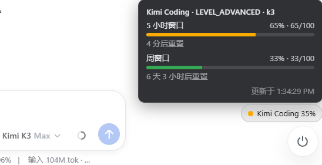

# dsh-quota-capsule

[English](README.md) | 中文

DSH（DeepSeek Harness）Web GUI 的供应商配额胶囊。右下角一个小胶囊，显示
**当前会话所用模型供应商**的套餐用量：彩色圆点 + 剩余百分比，点击展开
各窗口进度条与重置倒计时。



## 支持的供应商

| 供应商 | 数据源 | 窗口 |
|---|---|---|
| GLM Coding Plan（`zai-coding-cn`） | `/api/monitor/usage/quota/limit` | 5 小时 / 周 |
| Kimi Coding（`kimi-coding`） | `/coding/v1/usages` | 5 小时 / 周 |
| MiniMax Token Plan（`minimax-cn`） | `/v1/token_plan/remains` | 5 小时 / 周 |
| DeepSeek（`deepseek`） | `/user/balance` | 余额 |
| Codex / Claude / MiMo | — | 适配器占位，待接入 |

胶囊跟随会话当前模型的供应商：交互栏切到 Kimi 就显示 Kimi 配额，切回
GLM 就显示 GLM。

## 安装

```sh
dsh plugin --profile web add @heiweilu/dsh-quota-capsule
```

开发模式（本地仓库）：

```sh
dsh plugin --profile web add link:/path/to/dsh-quota-capsule
```

安装后重启 `dsh web`。

## API key 与安全

- key 按请求实时读取：先环境变量，再 DSH 本地凭据库
  （`~/.dsh/.credentials.yaml`）。插件不写盘、不上报，key 只发往其所属的
  供应商接口。
- 状态路由 `/dsh-quota-capsule/state` 仅监听环回地址（loopback-only）。
- 界面颜色全部使用 DSH 主题令牌，深浅色主题自适应。

## 实现

- Host（`lib/index.js`）：供应商适配器把各家响应归一化为
  `{ windows: [{ key, label, usedPct, detail, resetAt }], balance?, plan? }`，
  30 秒缓存，经 `GET /dsh-quota-capsule/state` 输出。
- Client（`lib/client.js`）：注册进 `conversation.composer.dock`
  （session 作用域，携带 sessionId），30 秒轮询渲染胶囊 + 详情卡。

## License

MIT
